# ExtendiLite EMR - Flow Diagrams Documentation

**Version:** 1.0.0.2  
**Date:** January 2026  
**Classification:** CONFIDENTIAL

---

## 1. Overview

This document provides visual flow diagrams for all major workflows within the ExtendiLite EMR system. Diagrams are presented in Mermaid format for easy rendering and modification.

---

## 2. Authentication Flows

### 2.1 Login Flow

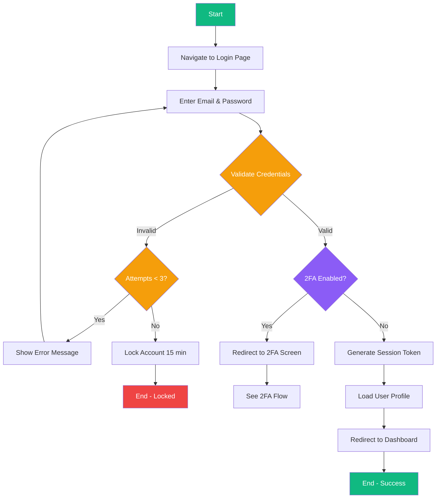

### 2.2 Two-Factor Authentication (2FA) Flow

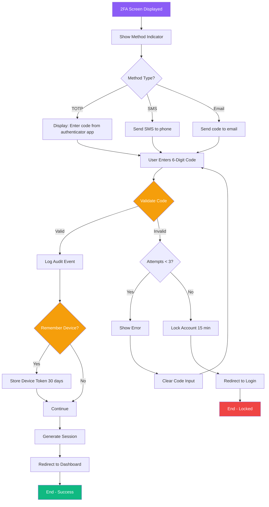

**2FA Security Features:**
- TOTP codes expire every 30 seconds
- SMS/Email codes expire after 5 minutes  
- Maximum 3 failed attempts before lockout
- Device can be remembered for 30 days
- All attempts logged for audit

### 2.3 Session Timeout Flow

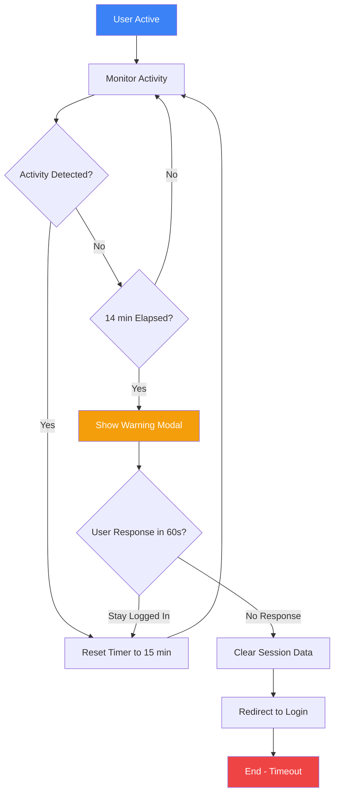

### 2.4 Re-Authentication Flow (PHI Access)

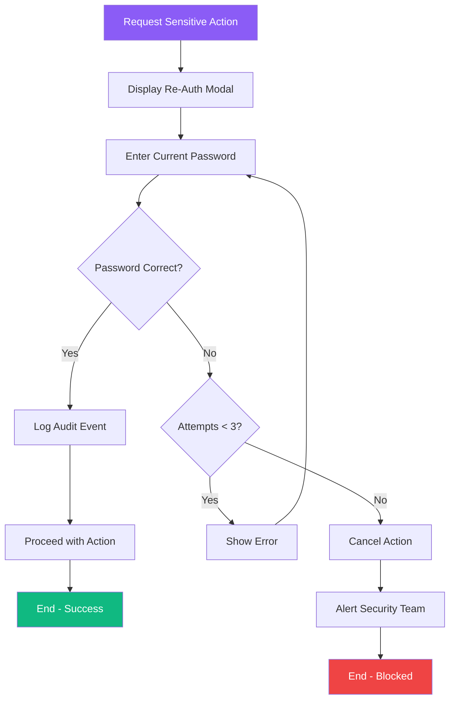

### 2.4 Logout Flow

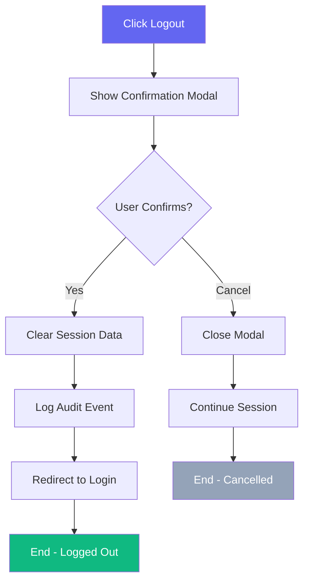

---

## 3. Patient Management Flows

### 3.1 Patient Queue Flow

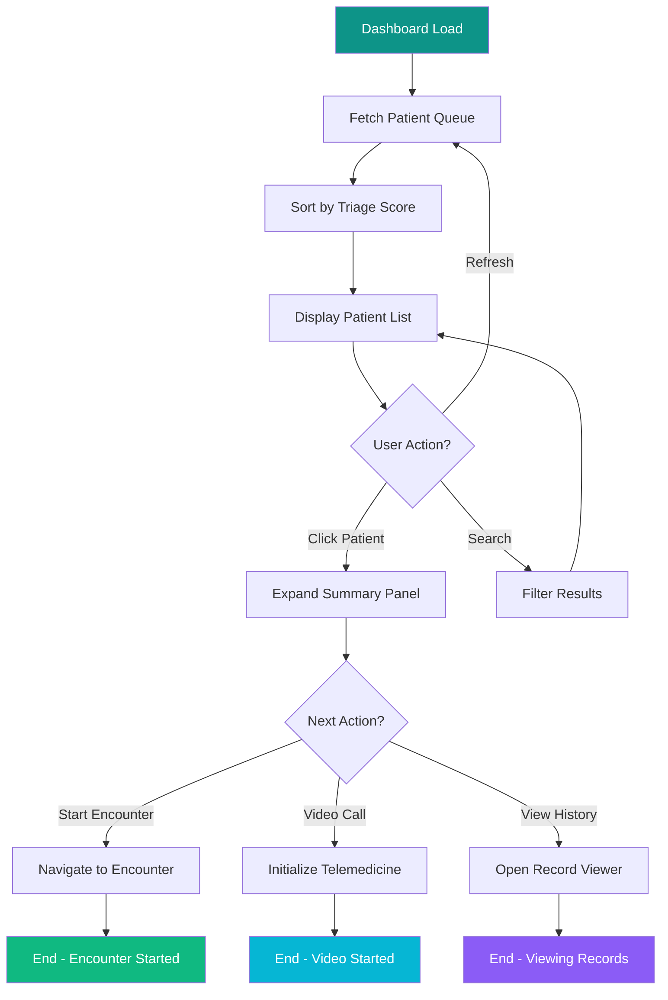

### 3.2 Patient Registration Flow

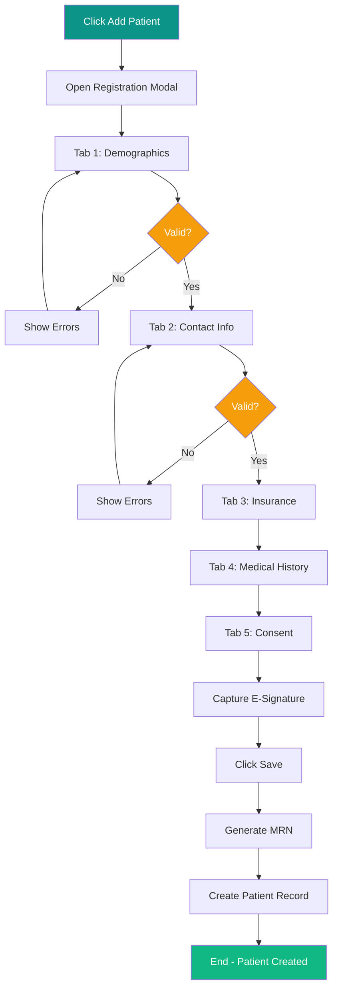

### 3.3 Patient Lookup Flow

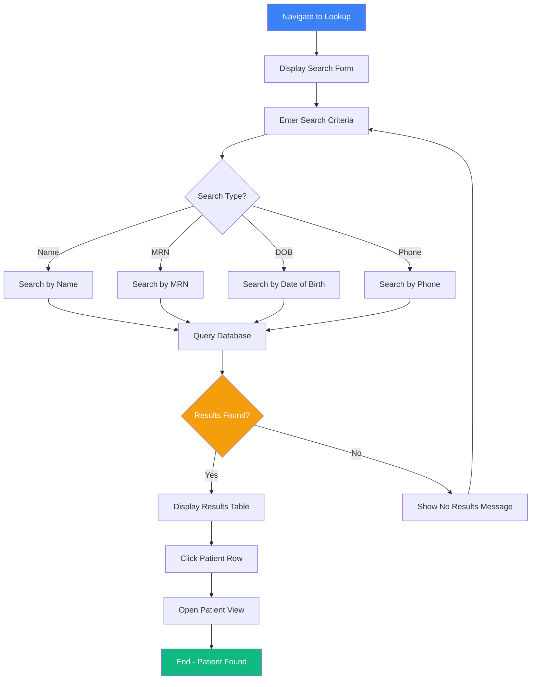

---

## 4. Clinical Documentation Flows

### 4.1 SOAP Documentation Flow

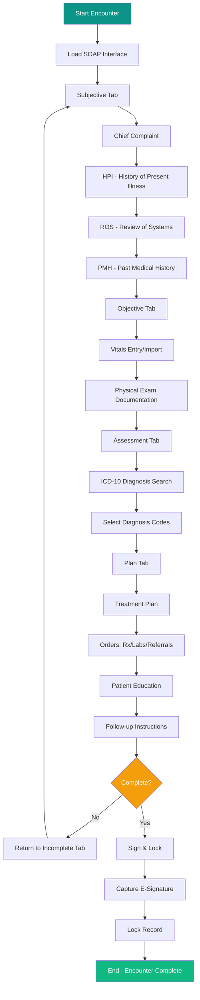

### 4.2 Voice Dictation Flow

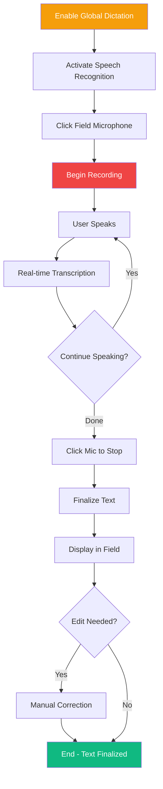

---

## 5. E-Prescribing Flow

### 5.1 Prescription Creation Flow

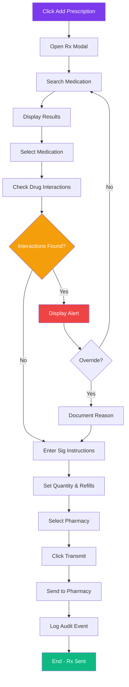

### 5.2 Prescription Status Flow

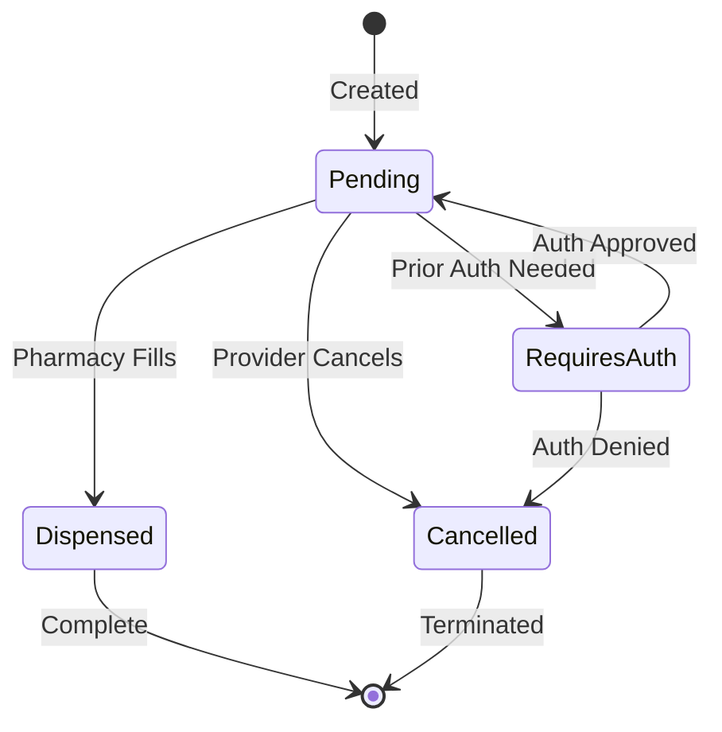

---

## 6. Lab Orders Flow

### 6.1 Lab Order Creation Flow

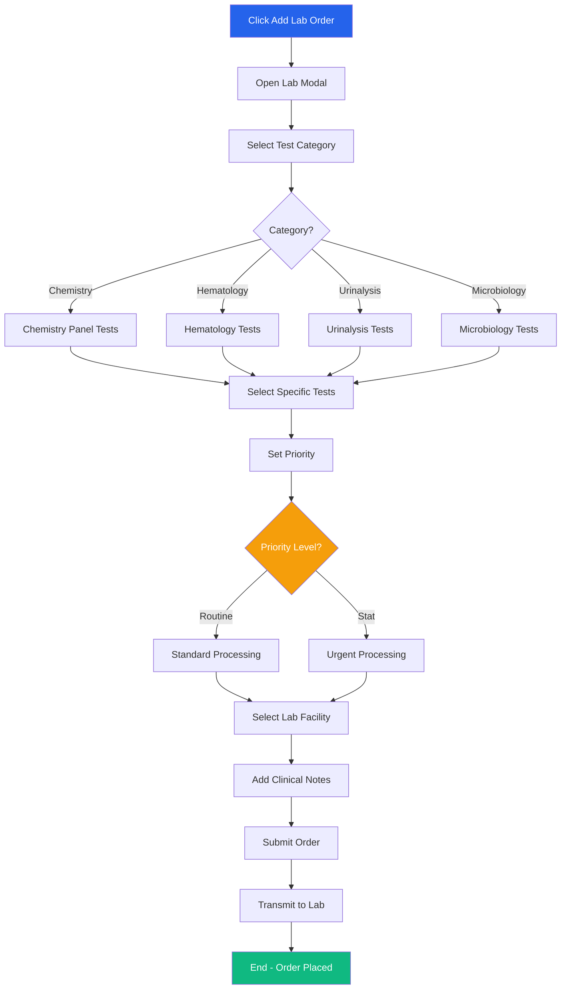

### 6.2 Lab Results Flow

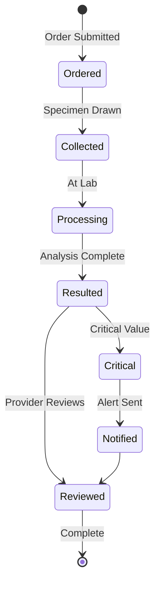

---

## 7. Referral Flow

### 7.1 Referral Creation Flow

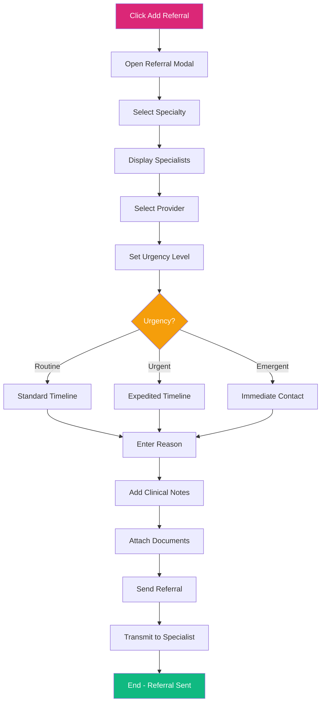

### 7.2 Referral Status Flow

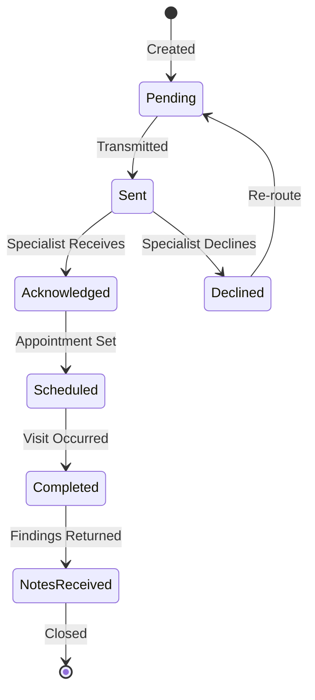

---

## 8. Messaging Flow

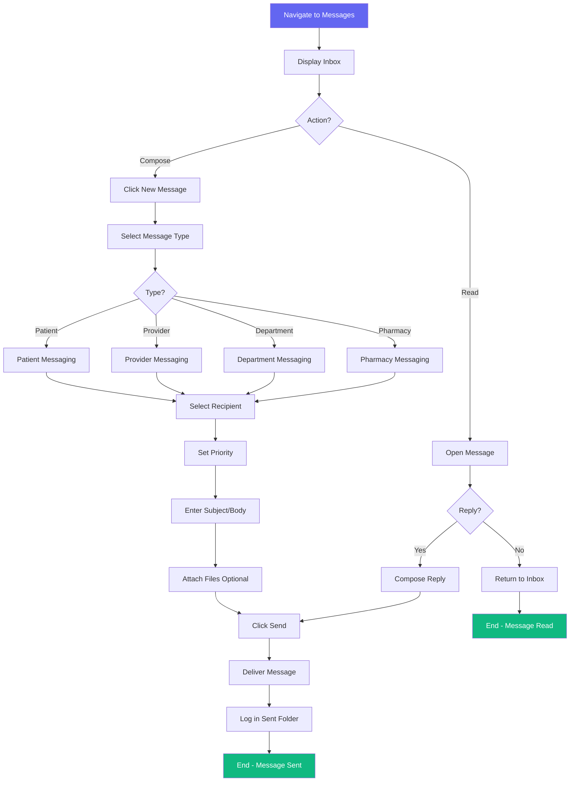

---

## 9. Appointment Scheduling Flow

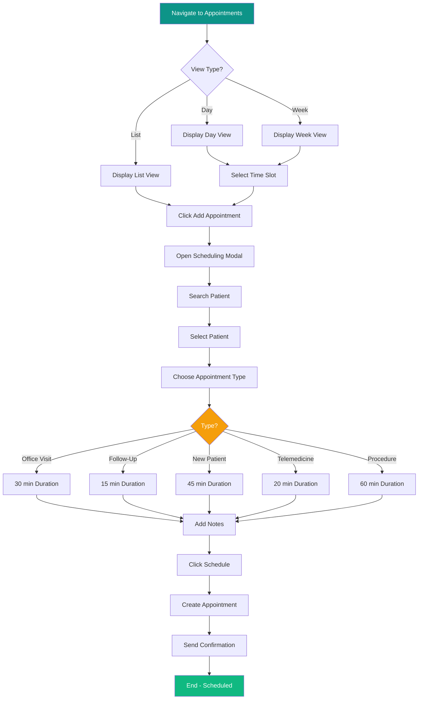

---

## 10. Complete Patient Encounter Flow

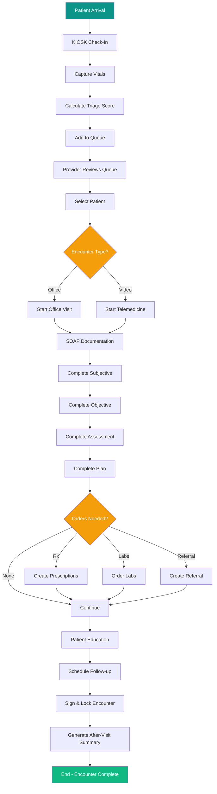

---

## 11. Audit Trail Flow

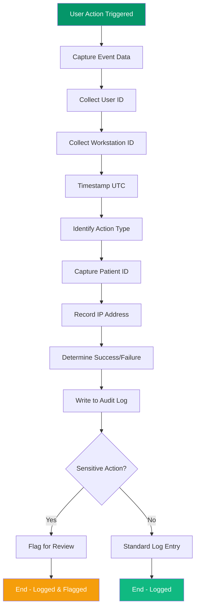

---

## Document Control

| Version | Date | Author | Changes |
|---------|------|--------|---------|
| 1.0.0.1 | Jan 2026 | ExtendiLite Team | Initial release |
| 1.0.0.2 | Jan 2026 | ExtendiLite Team | Added Two-Factor Authentication (2FA) flow diagram |

---

*© 2026 ExtendiLite Health Technologies Inc. All rights reserved.*
